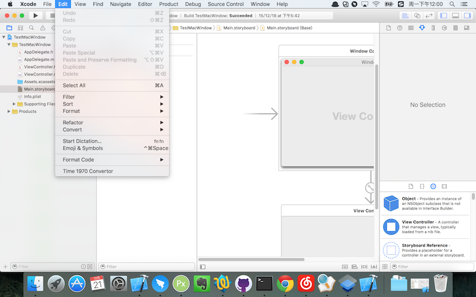
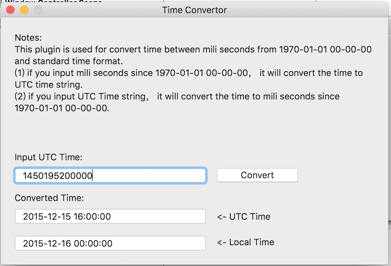

# Time1970Convertor
===========

##Screen shot
There should be a `Plug-ins` item in the xcode menu:

When you click the menu, convert window will show:

## Install

1. Build the project to install the plugin. The plugin is installed in `/Library/Application Support/Developer/Shared/Xcode/Plug-ins/Time1970Convertor.xcplugin`.

2. Restart Xcode for the plugin to be activated.

Alternatively, install through [Alcatraz](https://github.com/supermarin/Alcatraz) plugin manager.

### Pull requests

If you want to contribute, send me a pull request.
